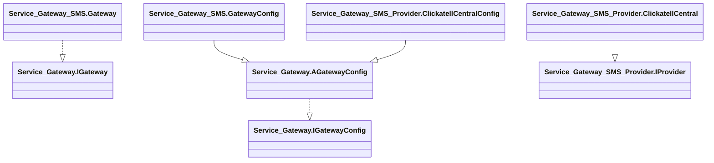

```mermaid
classDiagram

%% Service.Gateway
class Service_Gateway.IGatewayConfig
class Service_Gateway.IGateway
%% class Service_Gateway.Factory
class Service_Gateway.AGatewayConfig
Service_Gateway.AGatewayConfig ..|> Service_Gateway.IGatewayConfig
%% class Service_Gateway.State

%% %% Service.Gateway.XMPP
%% class Service_Gateway_XMPP.Gateway
%% Service_Gateway_XMPP.Gateway ..|> Service_Gateway.IGateway
%% class Service_Gateway_XMPP.GatewayConfig
%% Service_Gateway_XMPP.GatewayConfig --|> Service_Gateway.AGatewayConfig

%% Service.Gateway.SMS
class Service_Gateway_SMS.Gateway
Service_Gateway_SMS.Gateway ..|> Service_Gateway.IGateway
class Service_Gateway_SMS.GatewayConfig
Service_Gateway_SMS.GatewayConfig --|> Service_Gateway.AGatewayConfig

%% Service.Gateway.SMS.Provider
class Service_Gateway_SMS_Provider.IProvider
class Service_Gateway_SMS_Provider.ClickatellCentral
Service_Gateway_SMS_Provider.ClickatellCentral ..|> Service_Gateway_SMS_Provider.IProvider
class Service_Gateway_SMS_Provider.ClickatellCentralConfig
Service_Gateway_SMS_Provider.ClickatellCentralConfig --|> Service_Gateway.AGatewayConfig


```
